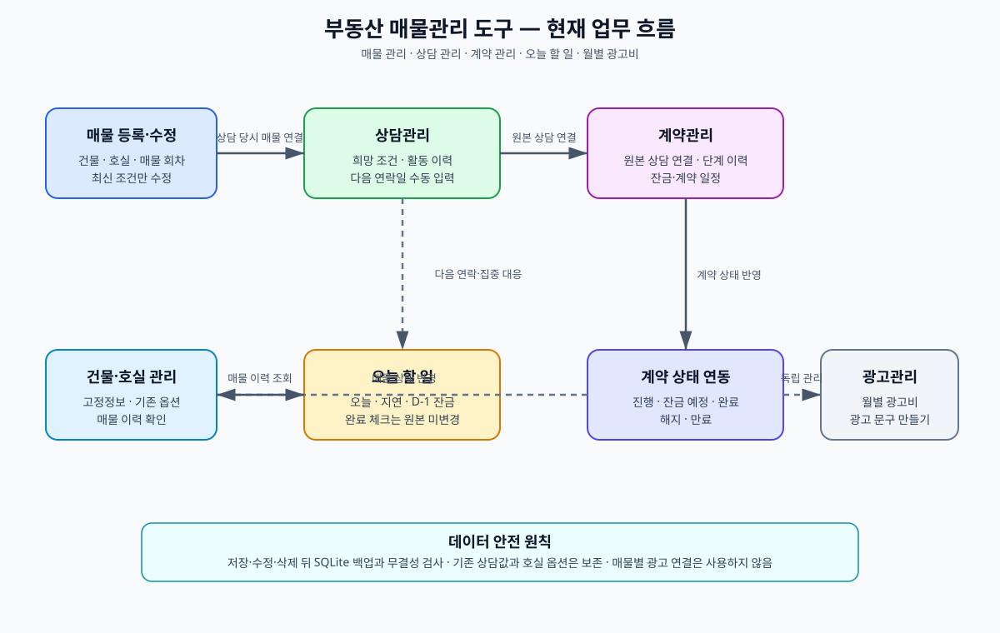
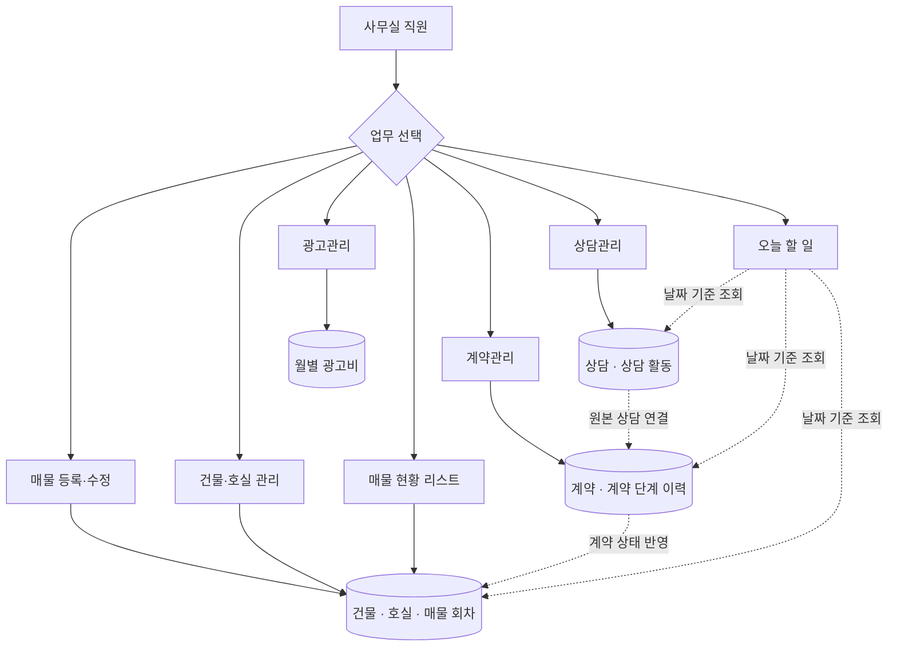
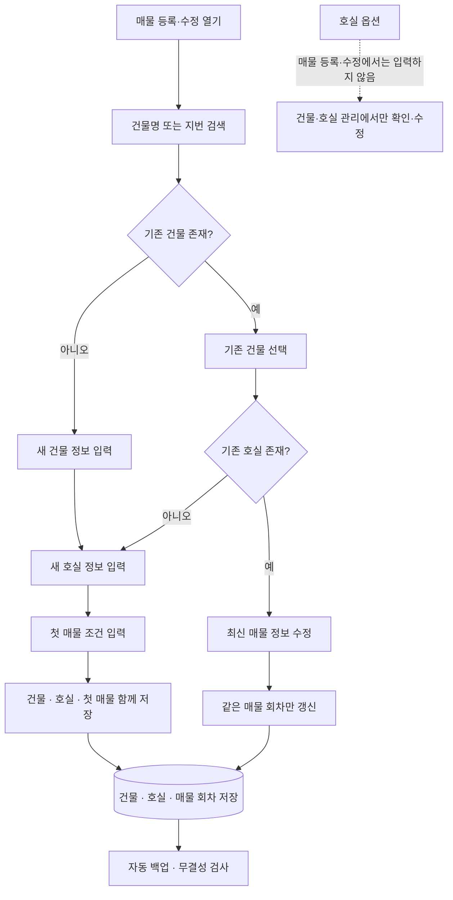
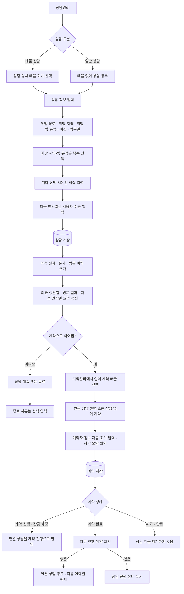
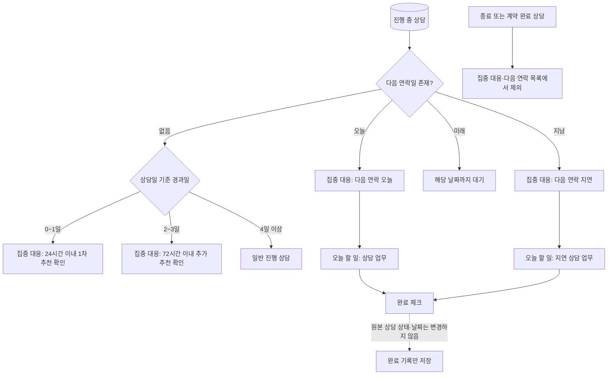
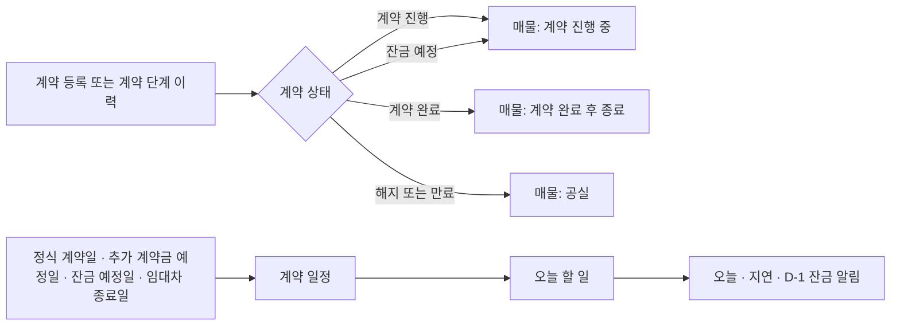
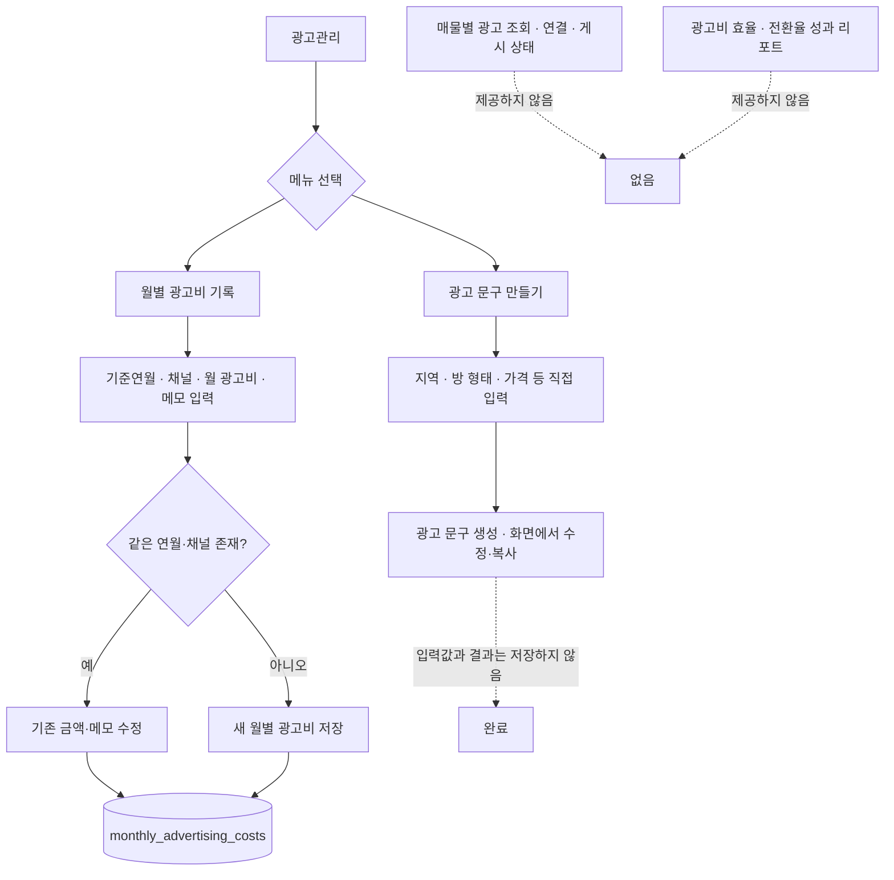
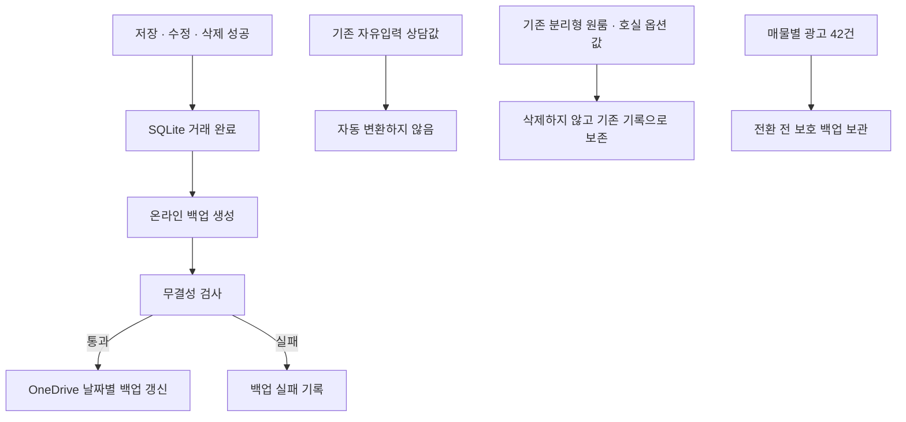

# 부동산 매물관리 도구 — 현재 업무 흐름도

> 기준일: 2026-08-22  
> 기준: 실제 구현과 최신 업무 흐름서. 과거 매물별 광고 연결 기능은 포함하지 않는다.

## 빠른 그래프 보기

위 그림은 바로 확인하는 전체 흐름이고, 아래 Mermaid 다이어그램은 세부 업무 규칙까지 포함한다.

## 1. 전체 메뉴와 업무 연결

## 2. 매물 등록·수정 흐름

## 3. 상담부터 계약 완료까지

## 4. 상담 집중 대응과 오늘 할 일

## 5. 계약 일정과 매물 상태 반영

## 6. 광고관리 흐름

## 7. 데이터 보존과 백업 원칙

## 현재 범위에서 하지 않는 일

- 매물별 광고 조회·연결·게시 상태 관리
- 상담·방문·계약 전환율 또는 광고비 효율 성과 리포트
- 다음 연락일 자동 제안·자동 변경
- 종료 사유 미입력 경고 또는 저장 차단
- 자동 문자, 방문 예약, 외부 광고 자동 등록
